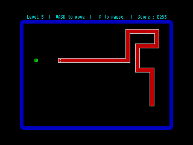
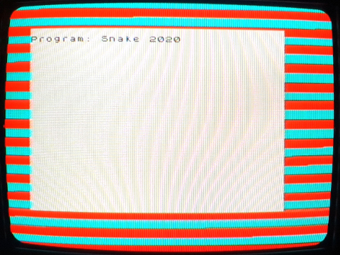

# zx-spectrum-snake
A port of the classic Snake/Tron game for the ZX Spectrum 48K, written in C

 

* * *

Game features:
--------------

* Fast, responsive and precise snake movement using WASD keys
* 9 speed-based skill levels ranging from 1 (slow) to 9 (fast)
* Pause key for looking at that notification in your phone

* * *
This game has been developed for the Sinclair ZX Spectrum 48K using the wonderful z88dk zcc C compiler.

https://www.z88dk.org/

z88dk is multiplatform, but I have developed this project on Windows 10 using Visual Studio Code as IDE, and compiling from the command line (CMD).

I have used [version 1.99C](https://github.com/z88dk/z88dk/releases/tag/v1.99c) of z88dk.

In my computer, I installed z88dk onto at C:\z88dk, as it appears to be NOT relocatable.

I have provided two .BAT scripts:

* _z88dk_set_path.bat_ for setting the path for the compiler
* _snake_compile.bat_ for compiling the snake project

The compiler generates a .TAP file ready for opening in an emulator.

I have used [Tapir 1.0](http://live.worldofspectrum.org/files/download/85e494512c1511c) for generating a .WAV file and load the game into a REAL spectrum.

* * *

Running on a REAL Spectrum!!!

I have a ZX Spectrum 48K for which I have performed the composite video mod, so I can connect it to an old 14 inch CRT TV via SCART. The image quality is good and the 64-column text is readable.

For loading the Spectrum, I use a LG G4 mobile phone connected via mono jack cable, from the earphone port in the phone to the ear port in the Spectrum.

The volume on the phone is set to maximum, and I use the Foobar2000 player for playing the WAV. I have tweaked the Foobar2000 settings, with all the bands in the DSP equalizer set to +6 dB. 

With these settings, the red/cyan stripes for the pilot tone have the same width, the load tones are heard clearly through the Spectrum speaker and the game loads OK.

When the red/cyan stripes have different widths, it is usually due to low audio volume, and games may fail to load.
